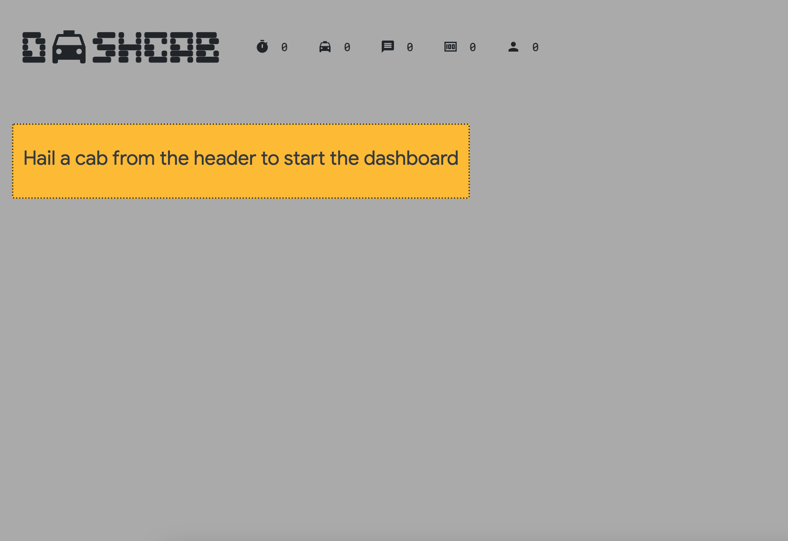
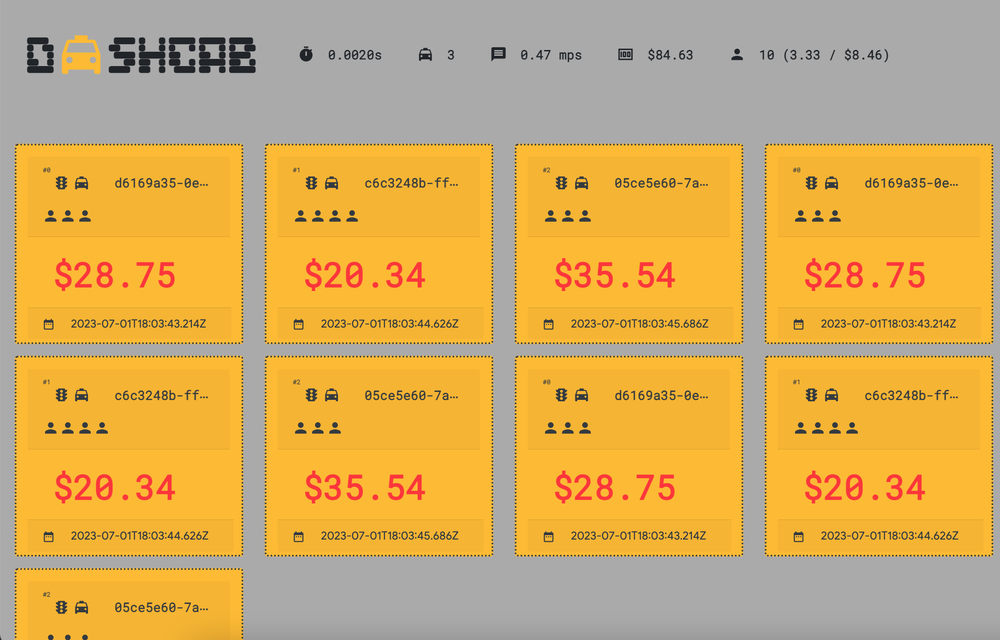

# Pubsub on websocket client server example

This repos tests Golang websockets and a simple in-memory pub/sub broker to share messages.

## Usage

### Install

```sh
go mod download
```

### Run server

```sh
go run cmd/server/main.go

   ____    __
  / __/___/ /  ___
 / _// __/ _ \/ _ \
/___/\__/_//_/\___/ v4.10.2
High performance, minimalist Go web framework
https://echo.labstack.com
____________________________________O/_______
                                    O\
⇨ http server started on [::]:12345
```

### Dashboard

The dashboard has been copied from GoogleCloud tutorial: [Streaming Pub/Sub messages over WebSockets](https://cloud.google.com/pubsub/docs/streaming-cloud-pub-sub-messages-over-websockets).

Open you browser to see dashboard `localhost:12345`



Click on the cab in the Dashcab title on top left corner.


### Client

Run the client to send a fake cab course.

```sh
go run cmd/client/main.go
```

Then check the dashboard.



### Development

Install [air](https://github.com/cosmtrek/air)

```sh
go install github.com/cosmtrek/air@latest
```

Run watcher
```sh
air

  __    _   ___  
 / /\  | | | |_) 
/_/--\ |_| |_| \_ , built with Go 

watching .
watching cmd
watching cmd/client
watching cmd/server
watching internal
watching internal/pubsub
!exclude panel
!exclude tmp
building...
running...

   ____    __
  / __/___/ /  ___
 / _// __/ _ \/ _ \
/___/\__/_//_/\___/ v4.10.2
High performance, minimalist Go web framework
https://echo.labstack.com
____________________________________O/_______
                                    O\
⇨ http server started on [::]:12345
```
